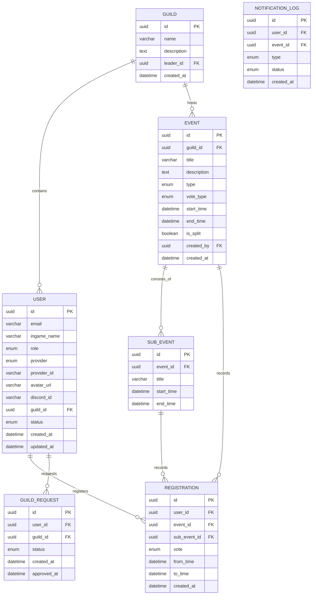

# Database ERD Detail - Kim Lan Guild

## I. Detailed ERD

### 1️⃣ Main Entity List

#### 1. User
| Field | Type | Note |
| :--- | :--- | :--- |
| id | UUID | PK |
| email | varchar | unique |
| ingame_name | varchar | required |
| role | enum | ADMIN, LEADER, VICE, MEMBER |
| provider | enum | GOOGLE, DISCORD, FACEBOOK |
| provider_id | varchar | id from OAuth |
| avatar_url | varchar | nullable |
| discord_id | varchar | nullable |
| guild_id | UUID | FK |
| status | enum | ACTIVE, PENDING, BLOCKED |
| created_at | datetime | |
| updated_at | datetime | |

#### 2. Guild (Kim Lan)
| Field | Type | Note |
| :--- | :--- | :--- |
| id | UUID | PK |
| name | varchar | |
| description | text | |
| leader_id | UUID | FK User |
| created_at | datetime | |

#### 3. Guild_Request
| Field | Type | Note |
| :--- | :--- | :--- |
| id | UUID | PK |
| user_id | UUID | FK User |
| guild_id | UUID | FK Guild |
| status | enum | PENDING, APPROVED, REJECTED |
| created_at | datetime | |
| approved_at | datetime | |

#### 4. Event
| Field | Type | Note |
| :--- | :--- | :--- |
| id | UUID | PK |
| guild_id | UUID | FK Guild |
| title | varchar | |
| description | text | |
| type | enum | PHO_BAN, EVENT, HOAT_DONG_CHUNG |
| vote_type | enum | YES_NO, TIME_RANGE |
| start_time | datetime | |
| end_time | datetime | |
| is_split | boolean | |
| created_by | UUID | FK User |
| created_at | datetime | |

#### 5. Sub_Event
| Field | Type | Note |
| :--- | :--- | :--- |
| id | UUID | PK |
| event_id | UUID | FK Event |
| title | varchar | |
| start_time | datetime | |
| end_time | datetime | |

#### 6. Registration
| Field | Type | Note |
| :--- | :--- | :--- |
| id | UUID | PK |
| user_id | UUID | FK User |
| event_id | UUID | FK Event |
| sub_event_id | UUID | FK Sub_Event (nullable) |
| vote | enum | YES, NO |
| from_time | datetime | |
| to_time | datetime | |
| created_at | datetime | |

#### 7. Notification_Log
| Field | Type | Note |
| :--- | :--- | :--- |
| id | UUID | PK |
| user_id | UUID | FK User |
| event_id | UUID | FK Event |
| type | enum | EMAIL, DISCORD |
| status | enum | SENT, FAILED |
| created_at | datetime | |

---

### 2️⃣ Relationships

- **User (1) ---- (N) Registration**
- **User (1) ---- (N) Guild_Request**
- **Guild (1) ---- (N) User**
- **Guild (1) ---- (N) Event**
- **Event (1) ---- (N) Sub_Event**
- **Event (1) ---- (N) Registration**
- **Sub_Event (1) ---- (N) Registration**

## Mermaid ERD Visualization

