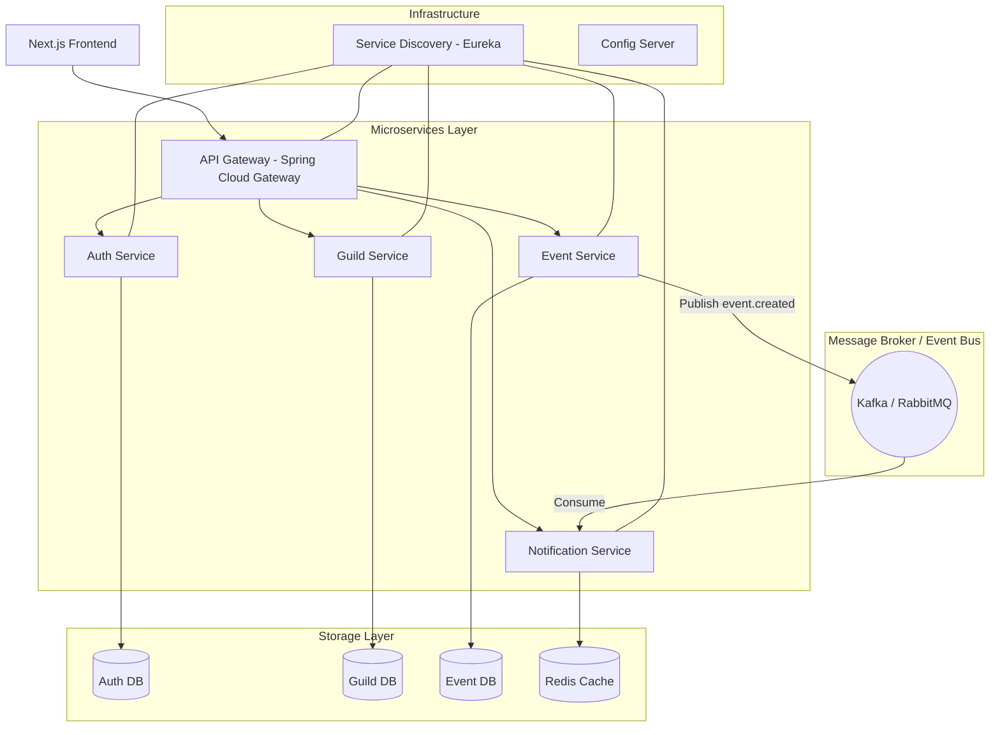

# Thiết Kế Microservice Architecture - Kim Lan Management

## 1️⃣ Tổng quan (Overview)

Sơ đồ kiến trúc tổng quát của hệ thống:

---

## 2️⃣ Các Service Chi Tiết

### 🔐 Auth Service
- **Chức năng:**
    - OAuth2 login (Google, Discord, Facebook).
    - JWT generation & validation.
    - Role management (RBAC).
- **Tech Stack:** Spring Security, OAuth2 Client.

### 🏯 Guild Service
- **Chức năng:**
    - Quản lý Guild (CRUD).
    - Hệ thống yêu cầu gia nhập (Join request).
    - Phê duyệt/Từ chối thành viên.
- **Lưu trữ:** Database riêng (`guild_db`).

### ⚔️ Event Service
- **Chức năng:**
    - Quản lý sự kiện (CRUD event).
    - Quản lý các Sub-events.
    - Đăng ký tham gia (Registration).
    - Thống kê (Statistics).
- **Lưu trữ:** Database riêng (`event_db`).

### 📧 Notification Service
- **Chức năng:**
    - Gửi thông báo qua Email.
    - Gửi thông báo qua Discord webhook.
    - Cron job: Nhắc nhở trước 30 phút.
    - Cơ chế Retry khi gửi lỗi.
- **Queue/Event Bus:** Kafka hoặc RabbitMQ.

---

## 3️⃣ Service Communication (Giao tiếp giữa các Service)

- **Option 1: REST Synchronous**
    - Auth → Gateway → Services (Giao tiếp trực tiếp qua HTTP).
- **Option 2 (Khuyên dùng): Event-driven**
    - Khi một Event được tạo:
        1. **Event Service** tạo thành công -> Publish message vào Kafka topic: `event.created`.
        2. **Notification Service** lắng nghe (consume) topic này.
        3. Thực hiện gửi Email và Discord alert tự động.

---

## 4️⃣ Infrastructure (Hạ tầng)

- **API Gateway:** Spring Cloud Gateway (Entry point duy nhất).
- **Service Discovery:** Netflix Eureka.
- **Cấu hình:** Spring Cloud Config Server.
- **Containerization:** Docker + Docker Compose.
- **CI/CD:** GitHub Actions.
- **Caching:** Redis (Lưu trữ cache statistics, session).
- **Event Bus:** Kafka / RabbitMQ.

---

## 5️⃣ Security Design (Thiết kế Bảo mật)

- **JWT Stateless:** Token không lưu trên server, chứa đầy đủ thông tin user/roles.
- **Gateway Verification:** Gateway kiểm tra chữ ký token và tính hợp lệ trước khi forward.
- **Services Trust Gateway:** Các service tin tưởng token đã qua kiểm duyệt ở Gateway.
- **RBAC Annotation:** Sử dụng `@PreAuthorize("hasRole('LEADER')")` tại tầng service/controller để phân quyền.

---

## 🚀 Deployment Architecture (Kiến trúc Triển khai)

### AWS EC2 / Server
- Chạy các container: Gateway, Auth, Guild, Event, Notification Services.
- Chạy các cụm bổ trợ: MySQL, Redis, Kafka.

### Frontend
- **Next.js:** Triển khai trên nền tảng **Vercel** để tối ưu hiệu năng và SSR.

---

## 📈 Scaling Strategy (Chiến lược Mở rộng)

- **Horizontal Scaling:** Mở rộng (scale-out) `Event Service` khi có lượng truy cập lớn.
- **Async Notification:** Sử dụng hàng đợi giúp việc gửi thông báo không làm chậm hệ thống chính.
- **Redis Cache:** Giảm tải cho database khi truy vấn các thông số thống kê.
- **Database Indexing:** Đảm bảo đánh index cho `event_id`, `guild_id`, và `user_id`.

---

## 🔮 Nâng Cấp Sau Này
*(Dành cho các giai đoạn tiếp theo)*
